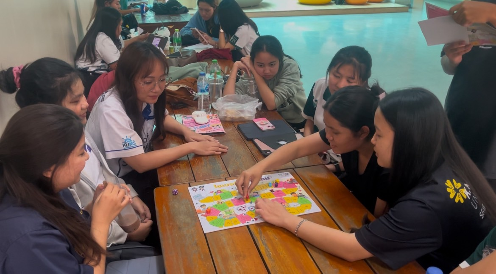
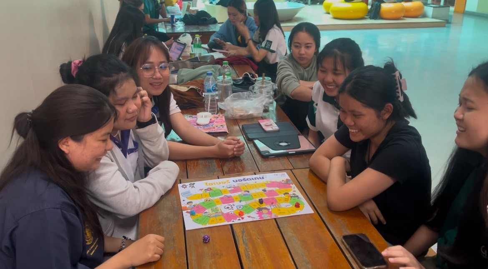
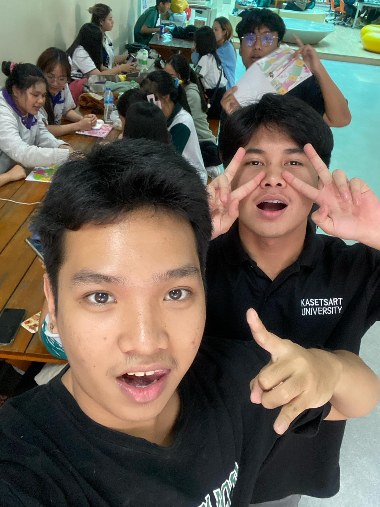
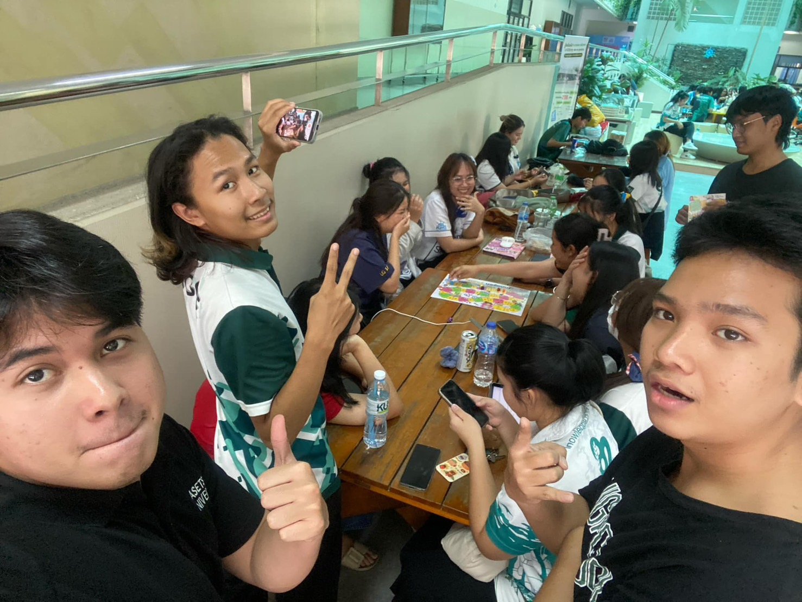
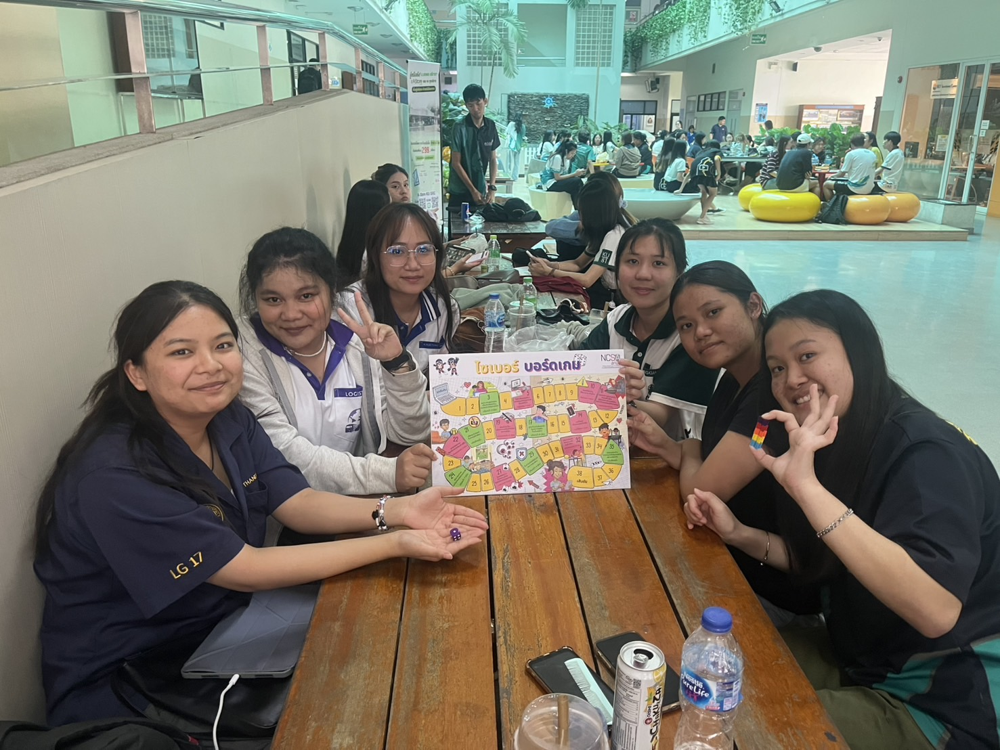

# Securing the Human
## Group : Seksan-Salahsakul

---

## **🌟 ภาพกิจกรรม**  
- 🖼️   
- 🖼️   
- 🖼️   
- 🖼️    

กิจกรรมนี้จัดทำโดยกลุ่ม **"Seksan-Salahsakul"** นิสิตสาขาวิทยาการคอมพิวเตอร์(Computer Science) ได้ดำเนินงานกิจกรรม "เล่น Boardgame Cyber จาก NCSA" เพื่อตระหนักรู้ถึงโลกไซเบอร์
โดยจัดทำกิจกรรมกับกลุ่มตัวอย่างที่เป็น **นิสิตคณะวิทยาการจัดการ สาขาการจัดการโลจิสติกส์ ชั้นปีที่ 3 ทั้งหมด 6 คน** และยังมีการบันทึกภาพและวิดีโอซึ่งได้ขออนุญาติจากทางกลุ่มนิสิตเรียบร้อยแล้ว

## 📅วันทีทำกิจกรรม
วันจันทรที่ 21 มกราคม 2025 ณ ตึก 10 มหาวิทยาลัยเกษตรศาสตร์ วิทยาเขตศรีราชา

## **📖 ได้รับอะไรจาก Boardgame นี้?**  
🎮 **ความสนุกสนาน**: นิสิตที่เล่นเกมได้เพลิดเพลินไปกับกิจกรรม  
📴 **พักสายตา**: ได้ละเว้นจากหน้าจอและเทคโนโลยี  
🗣️ **แลกเปลี่ยนความคิดเห็น**: ได้พูดคุยเกี่ยวกับประเด็นในโลกไซเบอร์  
⚠️ **ความตระหนักรู้**: ทุกคนได้รับความเข้าใจถึงความเสี่ยงที่อาจเกิดขึ้นในโลกไซเบอร์  

---

## **🌈 ภาพรวมของกิจกรรม**  
- **📸 ภาพรวมจบกิจกรรม**:  
    
- **🎥 วิดีโอ**:  
  [วิดีโอกิจกรรม](path/to/video.mp4)  

---
## **👥 สมาชิกในกลุ่ม Seksan-Salahsakul**  
1. 🌟 **Tante Wanitchakorn** →  
2. 🌟 **Poramet Obyam** →  
3. 🌟 **Vorapol Boonrasri** →  
4. 🌟 **Wasawat Boonporn** →  
