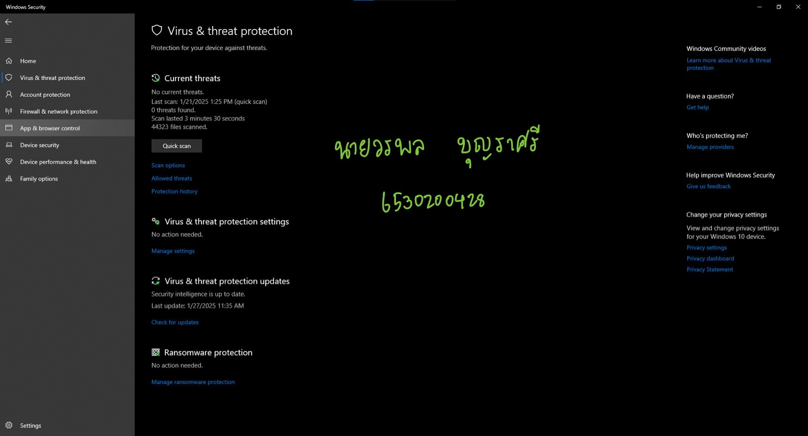

# Security Control
## Virus & threat protection คืออะไร?
Virus & threat protection เป็น function ความปลอดภัยในระบบปฎิบัติการ Window ซึ่งจุดประสงค์ของโปรแกรมคือเพื่อ **ปกป้องคอมพิวเตอร์จากไวรัส มัลแวร์ และภัยคุกคามต่างๆ** ในโลก Cyber  

### การจัดประเภท
- **Type of Security Control** : Technical Control  
- **Control Function** : Preventative, Detective, Corrective

### เหตุผล
Virus & threat protection ถูกจัดเป็นทั้ง 3 Control ดังนี้  
**1.) Preventative** : มีฟีเจอร์ป้องกันการติดไวรัสหรือมัลแวร์ตั้งแต่แรกก่อนที่มันจะส่งผลกระทบต่อระบบ ตัวอย่างเช่น  
1.1) Real-Time Protection : ตรวจสอบไฟล์ที่กำลังดาวน์โหลด  
1.2) Firewall Integration : ป้องกันการโจมตีจากเครือข่าย เช่น การเข้าถึงโดยไม่ได้รับอนุญาต  
  
**2.)Detective** : ฟีเจอร์ใน Virus & Threat Protection มีการตรวจสอบและแจ้งเตือนเมื่อพบภัยคุกคามที่ซ่อนอยู่หรือพยายามทำลายระบบ ตัวอย่างเช่น  
2.1) การสแกนไวรัส : สามารถสแกนไฟล์ที่น่าสงสัยหรือการกระทำที่เป็นอันตราย เช่น Full Scan หรือ Quick Scan  
2.2) การตรวจจับพฤติกรรมที่ผิดปกติ: เช่น การพยายามแก้ไขไฟล์ระบบ หรือการรันไฟล์ที่เข้ารหัส  

**3.)Corrective** : เมื่อระบบพบภัยคุกคาม Virus & Threat Protection มีฟีเจอร์ที่ช่วยกู้คืนและแก้ไขความเสียหาย รวมถึงกำจัดภัยคุกคามออกจากระบบ ตัวอย่างเช่น  
3.1) Quarantine (กักกัน): ไฟล์อันตรายจะถูกย้ายไปยังพื้นที่ปลอดภัยเพื่อป้องกันไม่ให้รันในระบบ  
3.2) การลบไวรัส: หลังจากการตรวจพบไวรัส ระบบสามารถลบไฟล์อันตรายเพื่อฟื้นฟูระบบให้ปลอดภัย  
3.3) Restore (กู้คืน): สามารถคืนค่าระบบหรือไฟล์ที่ได้รับผลกระทบให้กลับมาปกติ  
  
### ตัวอย่างการใช้งาน
- Preventative: ก่อนคุณจะดาวน์โหลดไฟล์จากอินเทอร์เน็ต Anti-virus จะสแกนไฟล์นั้นล่วงหน้าเพื่อตรวจสอบว่าปลอดภัยหรือไม่  
- Detective: หากคุณเสียบ USB ที่ติดไวรัสเข้ากับคอมพิวเตอร์ Anti-virus จะตรวจพบและแจ้งเตือนทันที  
- Corrective: Anti-virus จะลบไฟล์ไวรัสหรือกักกัน (Quarantine) ไฟล์นั้นไว้ในพื้นที่ปลอดภัย  
